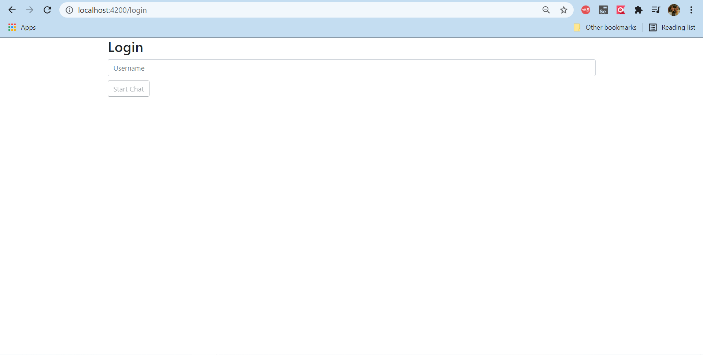
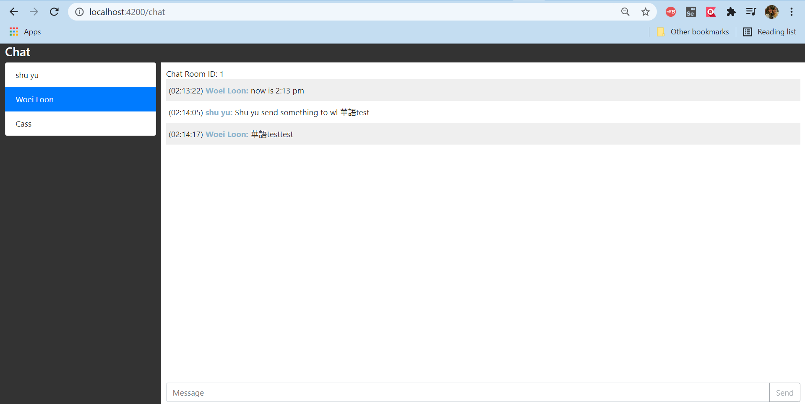

# Description
This is a very simple and buggy application code that I used for testing purpose. 

## Start Application 
1. Start application

        ng serve
2. URL: http://localhost:4200/login
3. Backend code cant be found here [Backend Code](https://github.com/shuyu6/chat-application-backend)

## Screenshot Application
1. Login page  

2. Chatroom page  

